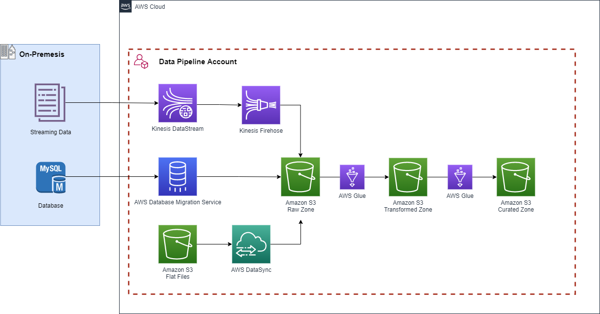

# Data-Pipeline-Foundations-Blueprint

## Purpose
The purpose of the Data Pipeline Foundaions is to provide a foundational example of a Data Pipeline (ingestion and transformation strategies) utilizing AWS services.

### Overview
For financial services organizations, much their data is stored in on-premises environments. With the vast number of systems and software tools in use by these organizations, data sources for a single business function are siloed. In this solution, we will utilize the concept of a data pipeline to eliminate inconveniences that come with the vast amount of data financial services companies have. A data pipeline is an automated series of steps in which our data is ingested, transformed, and stored.

### Architecture
The following diagram illustrates the architecture of the Data Pipeline:

Architecture Flow:
- Streaming data is ingested through Kinesis and stored in S3
- Data from an on-premises MySQL database is migrated to S3
- Flat Files in S3 are moved to the consolidated bucket
- Data is processed through Glue and stored in the transformed layer
- Data is further processed to create a curated view and stored in the curated layer

## Prerequisites
- You must have Python 3.8 or later installed and configured
- You must have boto3 installed
- You must have AWS CDK installed and configured..
- You must have your ~/.aws/credentials file configured with the an appropriate profile
- Create a sample MySQL database using a website such as https://www.freemysqlhosting.net/
- Add sample data to your MySQL database https://www.mysqltutorial.org/mysql-sample-database.aspx
- You must put the MySQL database credentials into Secrets Manager
   

## Deployment
Once all prerequisites have been satisfied, perform the following operations to deploy the project:

1) Run the command `cdk deploy DataIngestion` to deploy the Data Ingestion Stack

2) Navigate to the `streaming_data.py` file located in the `supplementary_scripts` folder. Specify the ARN of the secret created in the prerequisites. 

3) Run the `streaming_data.py` file to generate sample streaming data

4) Navigate to the `streaming_data.py` file located in the `supplementary_scripts` folder. Specify the ARN of the DMS task created in the Data Ingestion Stack. 

5) Run the `run_dms_task.py` file to kick off the Database Migration Service job.

6) Run the command `cdk deploy DataTransformations` to deploy the Data Transformation Stack

Note:
If your glue jobs need to deliver data to a particular folder in S3, instead of manually creating the partition you can run the `add_s3_bucket_partitions.py` file located in the `supplementary_scripts` folder and specify the bucket name and partition names. 

If everything is installed and configured correctly on the deployment machine, the Data Pipeline components will now be deployed into the target account.

## Teardown
Ensure you have the appropriate credentials configured and perform the following step to tear down the Data Pipeline:

1) Run the command `cdk destroy --all` to teardown all of the deployed Data Pipeline resources.

All deployed resources should now be removed from the target account.

